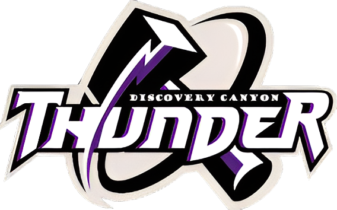

About Me
========
Recently graduated software engineer. Completed a Bachelor of Science degree in Computer Science with an emphasis in Software Engineering and a minor in Mathematics in three years, when the average is 4 years. I have experience in full stack development and implementing testing suites. I also have experience in network related aspects such as websockets. Extremely profficient in git and other standard Software Engineering procedures.

- Preferred Languages: Java, C, C#, or Python
- Favorite TV Show: Psych (2006)
- Favorite Music Artist: Twenty One Pilots

Education
=========
## Bachelor of Science in Computer Science
### University of Colorado, Colorado Springs

I started university education directly after graduating from high school. I was very efficient throughout the program, finishing in 3 years, with a mathematics minor and a GPA of 3.8 (in major GPA: 3.9). Having taken numerous software engineering related courses, I earned a specialty in Advanced Software Engineering.

- City, State: Colorado Springs, Colorado
- Years: 2021-2024
- Minor: Mathematics
- GPA: 3.8
- Specialty: Advanced Software Engineering

## High School Diploma
### Discovery Canyon Campus High School

- City, State: Colorado Springs, Colorado
- Years: 2017-2021

Work Experience
===============
## Teaching Assistant for ‘Data Structures and Algorithms’ and ‘Principles of Computer Science’ (Java Programming)
- Bug Fixing
- Communication
- Teamwork
- Time Management
- Troubleshooting
- Reinforced Foundation

In my role as a teaching assistant, I served as a crucial support for students, offering assistance with troubleshooting, bug fixing, and general problem-solving. Additionally, I undertook the responsibility of grading assignments, ensuring adherence to responsible standards of timeliness and fairness. This experience significantly contributed to the development of my work ethic and time management skills. Moreover, my experience as a TA for Data Structures and Algorithms reinforced my foundational skills in computer science.

Projects
========
## coinly (CSS, HTML, TypeScript Programming)
### The code for Coinly is not yet imported from the BitBucket Repository

- Angular Framework
- CoinGecko API
- Git/BitBucket
- HTML/CSS
- TypeScript

Focused on mobile screen sized resolutions, my team and I implemented the CoinGecko API to create a stock chart web app tailored for cryptocurrencies. On the frontend we employed the Skeleton framework to aid with screen size responsiveness. Utilizing Angular's component-based systems, we integrated multiple applications into a cohesive project. We ensured secure source control through pull requests on Git and BitBucket.
## harvestly (CSS, HTML, Python Programming)

- Django Framework
- Git/GitHub
- Google Maps API
- Implementing Tests
- Test Driven Development

As a vital member of a Scrum team, I actively contributed to the iterative development of a Django-based CRUD web application for market/product display. Integration of the Google Maps API enhanced user experience, and my proficiency in Git ensured a smooth collaborative process with efficient branching and pull requests. Rigorous testing and coverage tools were implemented to guarantee code reliability in future iterations.
## operating-systems (C Programming, Makefile Script)

- Implementing Custom Datastructures
- Kernel Level Threading
- Makefile Script
- Memory Management
- Mutex Utilization
- Virtual Machine Experience

Throughout my operating systems experience, I completed three porjects. The first project involved refreshing C programming skills, utilizing the command line, and writing a Makefile. I developed a linked list data structure in C, implemented separate test files for validation, and wrote a Makefile to compile the source code. The second project focused on studying Linux kernel modules and understanding process management in the Linux OS. I created a basic kernel module that achieved basic functionalities to gain insights into kernel-level programming. The third project centered on practicing Pthread programming to solve various concurrent problems. I mastered Pthread creation and termination, utilized mutexes along with conditional variables, and designed efficient solutions for mutual exclusion problems. Each project required thorough documentation, adherence to coding standards, and effective problem-solving techniques.
## programming-with-cs (C# Programming)
- Attention to Details
- User I/O Validation
- Problem Solving
- Value of Planning
- Visual Studio UI Tools

Similarly to operating systems, my C# experience consists of three main projects. 

Project 1 involves the creation of a Battleship game. It includes classes for ships and the game board. The Ship class defines properties such as type, length, and life, along with methods for setting coordinates, checking if the ship is sunk, and incrementing hits. The GameBoard class manages the game board, filling it with empty spaces, enabling cheats, and printing the board with appropriate labels. This project lays the foundation for a Battleship game, implementing essential game logic and board management. 

Project 2 is a Minesweeper game built with Visual Studio UI tools. It features randomly placed mines on a grid, with players uncovering cells without hitting a mine. The game includes functionality for flagging suspected mine locations, revealing adjacent cells, and managing win or lose conditions. The user interface incorporates buttons for cells, labels for game information, and other UI elements for interaction. This project demonstrates the integration of game logic with a graphical user interface, making Minesweeper accessible and engaging to players. 

Project 3 presents a Wordle game interface also using the Visual Studio UI Tools. The WordleWindow class initializes the game window, including the title label and guess button. The game board consists of text boxes for entering guesses, with methods for managing text box focus and changing box colors based on feedback. The game includes logic for guessing words, testing for win or lose conditions, and displaying appropriate messages. Additionally, cheats may be enabled to display the random word to the user. This project showcases the implementation of a word-guessing game with interactive UI elements and game logic integration.
## wyrm-discord-socket (C# Programming)
- Socket Connections
- Developing with Limited Documentation
- Git/GitHub
- JSON Parsing

The objective of this project was to design a worm bot, that we called "Wyrm", tasked with extracting messages from a Discord server. Its purpose was to showcase the ease with which data can be gathered from Discord servers. I contributed to this team effort by developing a web socket to interface with the Discord "Gateway" WebSocket. Finding documentation for this project was a significant challenge due to its scarcity. There are some resources on the official [Discord Gateway](https://discord.com/developers/docs/topics/gateway) website. Throughout this project it was important to work from an ethical and legal frame of mind.

The Discord Gateway events are made up of three main parts:
- OpCode: An integer value indicating the event type.
- Event Name: A non-mandatory string field that may contain the subevent name.
- JSON Message: The event's data.

`wyrm-discord-socket/Websocket/DiscordSocketClient.cs` is the file where most of the web socket is implemented.

The socket initiates connections through the Login and Identify stages. Upon receiving a Hello opcode, which includes a heartbeat interval, a new thread is created to send heartbeat responses at that interval. With the connection established, the socket continuously monitors for new opcodes. Upon reception, each opcode is parsed, logged, and ensures that a subscribable delegate can access relevant information to be used else where in the program.

Contained in the repository is a slide deck from my groups' final presentaiton and the C# code relating to the WebSocket.
## scripts (Batch Script, Python Script, and Visual Basic Script)
- Batch Scripting
- .env File Utilization
- HotKey Utilization
- OpenSSL Encryption
- Python Scripting
- Task Automation
- .vbs File Utilization

In the Scripts project, I've developed several scripts to automate specific tasks. `encrypt.py` decrypts the `encrypted.enc` file using the encryption key from the `.env` file upon pressing `ctrl + alt + d`. Similarly, it can encrypt the `decrypted.txt` file by pressing `ctrl + alt + e`. `resize_programs.py` resizes my Discord, Google Chrome, and Spotify applications to predefined dimensions and positions with the shortcut `ctrl + alt + m`.
